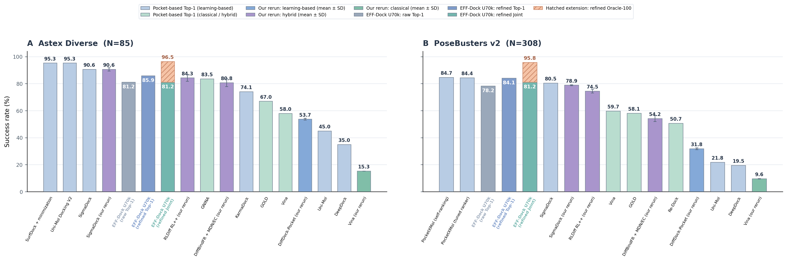

# EFF-Dock benchmark results

Released checkpoint pair:
`effdock_docking_early_time_t0p10_50k.pt` and
`effdock_confidence_s50_raw_refined_u70k.pt`.

Default inference preset: N100/S10, translation sigma 2.0, 10A pocket crop,
late-power-3 time schedule, and stable minimum predicted-RMSD ranking.

## Default U70k result

All rows use the promoted early-time docking checkpoint and U70k confidence
checkpoint on the same saved 100-pose candidate bank. RMSD is symmetry-aware
heavy-atom RMSD without alignment. `Raw` is the public sampler output.
`Refined` uses the separately evaluated deterministic physical refinement;
the public `dock` command does not apply it implicitly. `PB-valid` is official
PoseBusters 0.6.5 pass-all validity excluding the RMSD criterion. `Joint`
requires both PB-validity and refined RMSD `<2A`.

| Dataset | N | Raw Top-1 `<2A` | Refined Top-1 `<2A` | Refined oracle `<2A` | Refined PB-valid | Refined joint valid + `<2A` |
|---|---:|---:|---:|---:|---:|---:|
| Astex Diverse | 85 | 69 (81.18%) | 73 (85.88%) | 82 (96.47%) | 80 (94.12%) | 69 (81.18%) |
| PoseBusters v2 | 308 | 241 (78.25%) | 259 (84.09%) | 295 (95.78%) | 293 (95.13%) | 250 (81.17%) |
| PhiBench | 203 | 128 (63.05%) | 131 (64.53%) | 179 (88.18%) | 184 (90.64%) | 120 (59.11%) |
| FoldBench-Pocket full | 558 | 402 (72.04%) | 422 (75.63%) | 513 (91.94%) | 531 (95.16%) | 407 (72.94%) |
| FoldBench-Pocket post-cutoff | 66 | 45 (68.18%) | 47 (71.21%) | 57 (86.36%) | 59 (89.39%) | 44 (66.67%) |
| OpenBind | 860 | 422 (49.07%) | 477 (55.47%) | 773 (89.88%) | 848 (98.60%) | 470 (54.65%) |

The following external comparison is restricted to supplied-pocket methods and
uses the U70k rows above. It now includes both values reported by papers and
our completed three-repeat reruns. Reported and rerun bars are intentionally
different colors; reruns show mean ± sample SD. Its EFF-Dock bars distinguish
raw RMSD Top-1, refined RMSD Top-1, and the stricter refined Joint endpoint;
PB-validity is not shown as a separate bar. The hatched extension is refined
RMSD Oracle-100.

## Locally executed pocket baselines

These are our locally executed results under each repository's frozen
official/default pocket-redocking path, not copied paper values. Every entry is
the mean ± sample SD over three independent repeats. Missing targets and
unmappable poses remain failures in the full 85- or 308-complex denominator.
`Oracle` uses every RMSD-evaluable pose emitted by that method; Vina can emit
fewer than the requested 40 modes inside its default energy range.

| Executed method | Astex Top-1 `<2A` | Astex Oracle `<2A` | PoseBusters Top-1 `<2A` | PoseBusters Oracle `<2A` |
|---|---:|---:|---:|---:|
| SigmaDock official selector | 90.59 ± 1.18 | 98.43 ± 0.68 | 78.90 ± 0.32 | 92.53 ± 1.17 |
| RLDiff RL++ + GNINA | 84.31 ± 2.45 | 92.55 ± 2.45 | 74.46 ± 1.35 | 83.44 ± 0.56 |
| DiffBindFR + MDN/EC | 80.78 ± 2.96 | 94.90 ± 1.36 | 54.22 ± 2.27 | 85.28 ± 1.50 |
| DiffDock-Pocket + confidence | 53.73 ± 0.68 | 65.88 ± 1.18 | 31.82 ± 0.65 | 52.16 ± 0.75 |
| Vina, exhaustiveness 32 | 15.29 ± 0.00 | 32.55 ± 1.36 | 9.63 ± 0.19 | 25.97 ± 0.86 |

SigmaDock is the only external rerun in this table with a completed official
PB-valid selector: its Joint mean is `89.02 ± 1.36%` on Astex and
`76.41 ± 0.19%` on PoseBusters v2. Joint validity is not inferred for the
other RMSD-only reruns. SurfDock and Interformer remain omitted until every
generation, native-ranking, and three-repeat evaluation gate is complete.

Machine-readable rerun values are in
[`pocket_only_executed_reruns.json`](results/external_models/pocket_only_executed_reruns.json).
The common evaluation array was Slurm job `63112`; all 24 tasks completed with
exit code 0.

PhiBench and FoldBench are the core temporal checks. OpenBind is an auxiliary
dense enterovirus 2A-protease series and must not dominate a target-diverse
aggregate claim.

## Temporal benchmark literature context

These tables expose the relevant published numbers while retaining the input
and metric contract. PhiBench pocket-prior methods are shown in one contextual
table. FoldBench cofolding values are kept in a separate reference panel and
are never EFF-Dock comparison rows.
The complete source audit and machine-readable rows are in
[`TEMPORAL_LITERATURE.md`](../benchmarks/results/external_models/TEMPORAL_LITERATURE.md)
and
[`temporal_literature.json`](../benchmarks/results/external_models/temporal_literature.json).

### FoldBench protocol matrix

| Contract | EFF-Dock FoldBench-Pocket | FoldBench source-native leaderboard |
|---|---|---|
| Prediction task | Holo-receptor redocking | Complete-complex cofolding |
| Receptor | Experimental holo coordinates supplied | Predicted by the model |
| Pocket | Crystal pocket supplied | No crystal-pocket input |
| Selection | U70k confidence Top-1 | Model-native rank |
| Success endpoint | Symmetry LRMSD `<2A`; separate PB conjunction | LRMSD `<2A` and LDDT-PLI `>0.8` |
| Directly comparable | No | No |

EFF-Dock's full-558 holo-pocket results are `75.63%` refined Top-1 LRMSD
success and `72.94%` PB-valid/LRMSD joint success. The separate source-native
FoldBench cofolding reference panel reports AlphaFold 3 `64.90%`, Boltz-1
`55.04%`, Chai-1 `51.23%`, HelixFold 3 `51.82%`, Protenix `50.70%`, and
OpenFold 3 preview `44.49%`. These values must not be sorted together or used
for a relative performance claim.

### PhiBench context

| Method | Cohort | Pocket prior | Selection/endpoint | RMSD `<2A` | PB-valid + RMSD `<2A` |
|---|---:|:---:|---|---:|---:|
| EFF-Dock U70k | Derived 203 | Yes | Refined confidence Top-1 | 64.53% | 59.11% |
| EFF-Dock U70k | Derived 203 | Yes | Refined confidence Top-5 | 76.85% | 73.89% |
| PhysDock | Source-native 206 | Yes | Paper pocket-guided endpoint (Top-5) | 83.0% | 77.7% |
| SurfDock | Source-native 206 | Yes | Paper pocket-guided endpoint (Top-5) | 71.7% | 71.2% |
| Interformer | Source-native 206 | Yes | Paper pocket-guided endpoint (Top-5) | 68.3% | 63.3% |
| Uni-Mol Docking V2 | Source-native 206 | Yes | Paper pocket-guided endpoint (Top-5) | 53.3% | 52.2% |
| DiffDock-L | Source-native 206 | Yes | Paper pocket-guided endpoint (Top-5) | 39.8% | 35.5% |
| Glide | Source-native 206 | Yes | Paper pocket-guided endpoint (Top-5) | 25.4% | 24.3% |
| AutoDock Vina | Source-native 206 | Yes | Paper pocket-guided endpoint (Top-5) | 23.7% | 22.7% |
| DiffDock | Source-native 206 | Yes | Paper pocket-guided endpoint (Top-5) | 30.7% | 25.8% |

The EFF-Dock reconstruction contains 203 rather than 206 systems and uses a
confidence-ranked Top-1 production endpoint. The added Top-5 row evaluates all
1,015 ranked poses with PoseBusters and is closer to the paper endpoint, but
direct performance claims still require one shared manifest and scoring
contract. The immutable ledger is
[`phibench_u70k_top5.json`](../benchmarks/results/external_models/phibench_u70k_top5.json).

## Previous fixed-66 FoldBench campaign

The earlier fixed 66-system bank is retained because it used different
per-complex seeds from the 558-system campaign and is not an interchangeable
repeat.

| Campaign | N | Raw Top-1 `<2A` | Refined Top-1 `<2A` | Refined oracle `<2A` | PB-valid | Joint |
|---|---:|---:|---:|---:|---:|---:|
| Fixed post-cutoff bank | 66 | 42 (63.64%) | 45 (68.18%) | 58 (87.88%) | 60 (90.91%) | 44 (66.67%) |
| Full-558 post-cutoff slice | 66 | 45 (68.18%) | 47 (71.21%) | 57 (86.36%) | 59 (89.39%) | 44 (66.67%) |

## Checkpoint selection

U70k was selected only on the fixed 1,035-complex PLINDER validation bank:

| Checkpoint | Validation Top-1 `<2A` | Role |
|---|---:|---|
| U70k | 622/1,035 (60.10%) | selected `best.pt`; public default |
| U100k | 617/1,035 (59.61%) | terminal training state |

The external U100k comparison was run after this internal selection. Its
refined and joint endpoints were weaker than U70k on Astex, PhiBench,
FoldBench, and OpenBind. On PoseBusters, U100k gained one RMSD-only success but
lost two joint-valid successes. External results therefore agree with, but did
not determine, the U70k choice.

## Previous U50k comparison

The previous symmetry-confidence U50k checkpoint used the same saved
N100/S10/sigma-2 pose banks. Raw+refined U70k is not uniformly better on every
cohort, so the per-dataset result is retained explicitly.

| Dataset | U50k refined `<2A` | U70k refined `<2A` | U50k joint | U70k joint |
|---|---:|---:|---:|---:|
| Astex Diverse | 73 (85.88%) | 73 (85.88%) | 69 (81.18%) | 69 (81.18%) |
| PoseBusters v2 | 259 (84.09%) | 259 (84.09%) | 250 (81.17%) | 250 (81.17%) |
| PhiBench | 132 (65.02%) | 131 (64.53%) | 122 (60.10%) | 120 (59.11%) |
| FoldBench fixed-66 bank | 41 (62.12%) | 45 (68.18%) | 40 (60.61%) | 44 (66.67%) |
| OpenBind | 445 (51.74%) | 477 (55.47%) | 438 (50.93%) | 470 (54.65%) |

The justified claim is that raw+refined training preserves Astex and
PoseBusters, improves FoldBench and auxiliary OpenBind, and slightly regresses
PhiBench. It is not a universal per-benchmark improvement.

## Evaluation boundary and provenance

These are explicit-pocket pocket-redocking evaluations, not blind pocket
discovery, affinity prediction, or prospective screening. All five external
cohorts had been opened during development; their outcomes are descriptive and
must not be used to retune the checkpoint or selector.

- Astex/PoseBusters protocol and result:
  `S50_RAW_REFINED_CONFIDENCE_EXTERNAL_PROTOCOL.md` and
  `S50_RAW_REFINED_CONFIDENCE_EXTERNAL_RESULTS.md`
- Temporal protocol and result:
  `S50_RAW_REFINED_CONFIDENCE_TEMPORAL_EXTERNAL_PROTOCOL.md` and
  `S50_RAW_REFINED_CONFIDENCE_TEMPORAL_EXTERNAL_RESULTS.md`
- U70k checkpoint SHA-256:
  `ce59be42f0ca613871ca079127c3296f5ca9a4ec72e44a9e5cf61878351c2638`
- Paired docking checkpoint SHA-256:
  `65be44d7dc8f0867eb9fc5d22214b80f93971ea4702679a527c665046e91e6b6`
