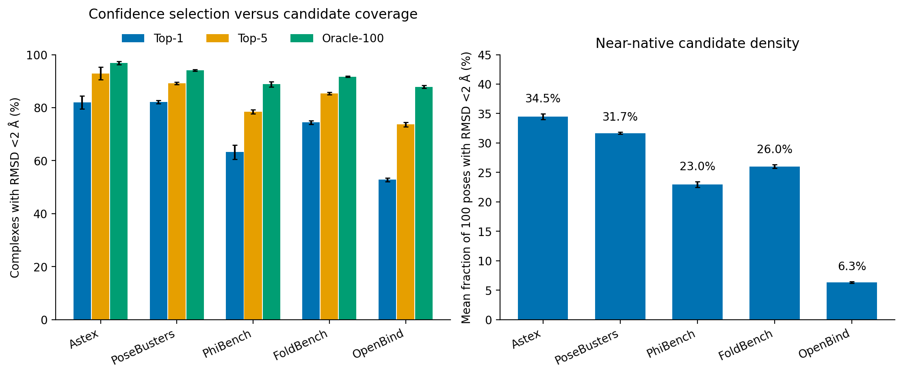

# Candidate generation and confidence selection

RMSD-only endpoints: strict symmetry-aware no-alignment RMSD <2 Å. Three-repeat mean ± sample SD (%). Top-1/Top-5 rank all candidates by predicted RMSD, with stable candidate-index ties; no chirality filter. Oracle uses reference RMSD only as a post-hoc upper bound. Candidate fraction averages equally over complexes.

| Dataset | Arm | Stage | Top-1 | Top-5 | Oracle | Candidate fraction |
|---|---|---|---:|---:|---:|---:|
| Astex | unguided_n100_s10 | raw | 82.75 ± 3.59 | 90.98 ± 0.68 | 96.47 ± 1.18 | 32.99 ± 0.49 |
| Astex | unguided_n100_s10 | refined | 81.96 ± 2.45 | 92.94 ± 2.35 | 96.86 ± 0.68 | 34.45 ± 0.49 |
| PoseBusters | unguided_n100_s10 | raw | 80.74 ± 0.19 | 89.83 ± 1.04 | 94.59 ± 0.19 | 30.03 ± 0.26 |
| PoseBusters | unguided_n100_s10 | refined | 82.14 ± 0.65 | 89.18 ± 0.50 | 94.16 ± 0.32 | 31.69 ± 0.15 |
| Astex | unguided_n40_s25 | raw | 80.00 ± 2.35 | 89.80 ± 4.13 | 94.12 ± 2.04 | 34.76 ± 1.16 |
| Astex | unguided_n40_s25 | refined | 80.39 ± 2.45 | 91.76 ± 3.11 | 94.51 ± 2.45 | 35.95 ± 0.77 |
| PoseBusters | unguided_n40_s25 | raw | 78.68 ± 0.68 | 89.50 ± 0.19 | 92.53 ± 1.30 | 31.97 ± 0.31 |
| PoseBusters | unguided_n40_s25 | refined | 81.06 ± 2.35 | 89.07 ± 0.68 | 93.07 ± 0.94 | 33.33 ± 0.13 |
| Astex | guided_n100_s10 | raw | 81.18 ± 2.04 | 92.55 ± 0.68 | 96.47 ± 1.18 | 33.22 ± 0.45 |
| Astex | guided_n100_s10 | refined | 82.35 ± 1.18 | 92.55 ± 1.80 | 96.47 ± 1.18 | 34.51 ± 0.41 |
| PoseBusters | guided_n100_s10 | raw | 80.63 ± 1.23 | 89.61 ± 0.56 | 93.94 ± 0.19 | 30.30 ± 0.27 |
| PoseBusters | guided_n100_s10 | refined | 82.68 ± 0.19 | 89.50 ± 0.82 | 94.26 ± 0.19 | 31.78 ± 0.18 |
| Astex | guided_n40_s25 | raw | 81.18 ± 2.04 | 89.41 ± 1.18 | 94.51 ± 2.45 | 34.91 ± 0.63 |
| Astex | guided_n40_s25 | refined | 80.00 ± 1.18 | 92.16 ± 2.45 | 94.51 ± 2.45 | 35.91 ± 0.57 |
| PoseBusters | guided_n40_s25 | raw | 80.09 ± 1.04 | 88.85 ± 1.23 | 92.86 ± 0.97 | 32.26 ± 0.31 |
| PoseBusters | guided_n40_s25 | refined | 80.74 ± 1.53 | 88.85 ± 0.37 | 93.07 ± 0.50 | 33.36 ± 0.13 |
| PhiBench | temporal_n100_s10 | raw | 60.36 ± 0.28 | 76.54 ± 1.56 | 86.73 ± 1.01 | 21.54 ± 0.52 |
| PhiBench | temporal_n100_s10 | refined | 63.27 ± 2.67 | 78.48 ± 0.74 | 88.83 ± 0.97 | 22.96 ± 0.50 |
| FoldBench | temporal_n100_s10 | raw | 72.46 ± 1.22 | 84.47 ± 0.92 | 91.34 ± 0.52 | 24.88 ± 0.31 |
| FoldBench | temporal_n100_s10 | refined | 74.43 ± 0.72 | 85.36 ± 0.41 | 91.70 ± 0.21 | 26.02 ± 0.30 |
| OpenBind | temporal_n100_s10 | raw | 49.55 ± 0.65 | 72.25 ± 0.63 | 85.44 ± 0.88 | 5.75 ± 0.13 |
| OpenBind | temporal_n100_s10 | refined | 52.79 ± 0.70 | 73.69 ± 0.84 | 87.86 ± 0.54 | 6.32 ± 0.14 |

## Manuscript interpretation

For refined unguided N100/S10, the oracle-to-Top-1 gaps are:

- Astex: 14.90 percentage points; mean 34.45 near-native candidates per 100.
- PoseBusters: 12.01 percentage points; mean 31.69 near-native candidates per 100.
- PhiBench: 25.57 percentage points; mean 22.96 near-native candidates per 100.
- FoldBench: 17.26 percentage points; mean 26.02 near-native candidates per 100.
- OpenBind: 35.06 percentage points; mean 6.32 near-native candidates per 100.

These gaps identify selection headroom in the saved banks, not guaranteed gains from another confidence model. Repeated seeds are sampling repeats on the same targets, not independent target cohorts. The candidate fraction does not measure geometric diversity.

**Figure 4.** Refined unguided N100/S10, five supplied-pocket cohorts. Left: ordinary confidence Top-1/Top-5 versus oracle coverage. Right: candidate near-native density. Whiskers are sample SD across three seeds. All endpoints are RMSD-only, not joint PB-valid.

## Unavailable endpoints

Saved selected-pose PB records cover baseline and chirality-filtered Top-1 only; temporal records include the disclosed compatibility repairs. Full-bank PB-valid fraction, joint-PB Top-5, and joint-PB oracle are **not available** and were not replaced by fast geometry or chirality labels. Producing these requires additional official PB evaluations, not another inference run.

## Reproducibility

`scripts/collect_paper_candidate_metrics.py` produces `candidate_metrics.json` and `candidate_cases.csv`; `scripts/paper_candidate_figures.py` produces this table and PNG/PDF. The collector verifies every confidence summary/score CSV hash, candidate order and both cached vectors. Cohort count, stage/repeat IDs, finite values, strict threshold, stable ranking and fallback are checked.
