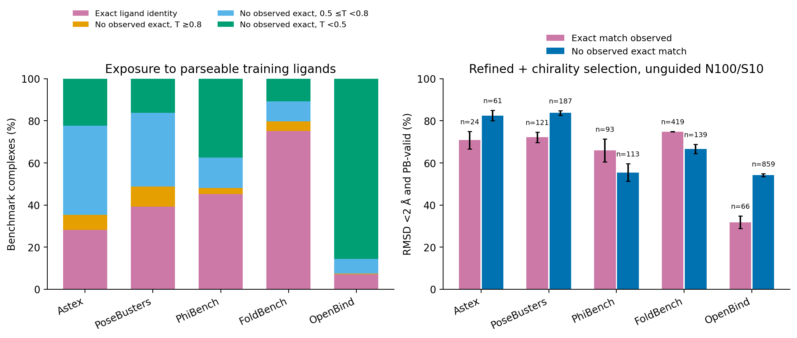

# Training exposure and stratified external performance

**This is not a proof of an overlap-free benchmark.** It audits the preserved checkpoint split, not the later strict split builder.

Executed fine-tuning membership: 47,277 train; preserved validation: 1,076 IDs. The metadata contains 47,276 parseable train entries and 1 unresolved train SMILES. There are 33,513 unique parseable heavy-isomeric training ligands. The 47,277-system loader index was verified against the ordered preserved 47,310-system split and loader filters by cache-key reconstruction and a content hash. This is the S50 fine-tuning membership, not a union of all predecessor pretraining exposure.

Exact identity uses RDKit canonical heavy-atom isomeric SMILES with explicit-H normalization, without tautomer/protonation standardization. Morgan radius-2 2,048-bit Tanimoto excludes chirality; nearest neighbors are over unique parseable training ligands. Exact identity takes priority over similarity bins. Bins (<0.5, 0.5–<0.8, ≥0.8) are descriptive, not tuned thresholds.

Because one training metadata ligand is unresolved, **no observed match** means no match in the parseable index, not certified absence from all training inputs. Nearest Tanimoto is likewise relative to the parseable index. No benchmark cases were removed and no malformed ligand was repaired silently.

| Dataset | Total | Observed exact train ligand | Exact train PDB accession | Observed val match but no observed train match |
|---|---:|---:|---:|---:|
| Astex | 85 | 24 (28.24%) | 3 | 0 |
| PoseBusters | 308 | 121 (39.29%) | 28 | 2 |
| PhiBench | 206 | 93 (45.15%) | 0 | 1 |
| FoldBench | 558 | 419 (75.09%) | 341 | 5 |
| OpenBind | 925 | 66 (7.14%) | unavailable | 0 |

## Exact-ligand strata: complete original cohorts

Refined + chirality-filtered unguided N100/S10; percent mean ± sample SD over three seeds.

| Dataset | Stratum | n/seed | RMSD <2 Å | PB-valid | Joint |
|---|---|---:|---:|---:|---:|
| Astex | no_observed_match | 61 | 85.25 ± 1.64 | 97.27 ± 0.95 | 82.51 ± 2.50 |
| Astex | observed_overlap | 24 | 75.00 ± 4.17 | 91.67 ± 0.00 | 70.83 ± 4.17 |
| FoldBench | no_observed_match | 139 | 70.26 ± 1.50 | 94.48 ± 0.42 | 66.67 ± 2.20 |
| FoldBench | observed_overlap | 419 | 75.89 ± 0.24 | 96.98 ± 0.36 | 74.86 ± 0.14 |
| OpenBind | no_observed_match | 859 | 54.17 ± 0.64 | 99.81 ± 0.13 | 54.17 ± 0.64 |
| OpenBind | observed_overlap | 66 | 31.82 ± 3.03 | 97.47 ± 0.87 | 31.82 ± 3.03 |
| PhiBench | no_observed_match | 113 | 57.23 ± 5.33 | 93.22 ± 1.35 | 55.46 ± 4.18 |
| PhiBench | observed_overlap | 93 | 69.18 ± 4.48 | 94.98 ± 1.24 | 65.95 ± 5.52 |
| PoseBusters | no_observed_match | 187 | 85.74 ± 0.82 | 96.97 ± 0.82 | 83.78 ± 1.11 |
| PoseBusters | observed_overlap | 121 | 75.21 ± 1.65 | 93.39 ± 1.65 | 72.18 ± 2.52 |

## Similarity strata

| Dataset | Stratum | n/seed | RMSD <2 Å | PB-valid | Joint |
|---|---|---:|---:|---:|---:|
| Astex | exact_identity | 24 | 75.00 ± 4.17 | 91.67 ± 0.00 | 70.83 ± 4.17 |
| Astex | no_observed_exact_0.5_to_<0.8 | 36 | 92.59 ± 1.60 | 98.15 ± 1.60 | 90.74 ± 1.60 |
| Astex | no_observed_exact_<0.5 | 19 | 71.93 ± 10.96 | 94.74 ± 0.00 | 66.67 ± 10.96 |
| Astex | no_observed_exact_>=0.8 | 6 | 83.33 ± 16.67 | 100.00 ± 0.00 | 83.33 ± 16.67 |
| FoldBench | exact_identity | 419 | 75.89 ± 0.24 | 96.98 ± 0.36 | 74.86 ± 0.14 |
| FoldBench | no_observed_exact_0.5_to_<0.8 | 53 | 76.10 ± 3.93 | 98.11 ± 1.89 | 74.84 ± 4.75 |
| FoldBench | no_observed_exact_<0.5 | 60 | 71.11 ± 0.96 | 92.22 ± 0.96 | 65.56 ± 0.96 |
| FoldBench | no_observed_exact_>=0.8 | 26 | 56.41 ± 2.22 | 92.31 ± 3.85 | 52.56 ± 2.22 |
| OpenBind | exact_identity | 66 | 31.82 ± 3.03 | 97.47 ± 0.87 | 31.82 ± 3.03 |
| OpenBind | no_observed_exact_0.5_to_<0.8 | 64 | 57.81 ± 4.13 | 100.00 ± 0.00 | 57.81 ± 4.13 |
| OpenBind | no_observed_exact_<0.5 | 792 | 53.75 ± 0.44 | 99.79 ± 0.15 | 53.75 ± 0.44 |
| OpenBind | no_observed_exact_>=0.8 | 3 | 88.89 ± 19.25 | 100.00 ± 0.00 | 88.89 ± 19.25 |
| PhiBench | exact_identity | 93 | 69.18 ± 4.48 | 94.98 ± 1.24 | 65.95 ± 5.52 |
| PhiBench | no_observed_exact_0.5_to_<0.8 | 30 | 52.22 ± 10.72 | 93.33 ± 0.00 | 52.22 ± 10.72 |
| PhiBench | no_observed_exact_<0.5 | 77 | 57.58 ± 3.00 | 95.67 ± 0.75 | 57.58 ± 3.00 |
| PhiBench | no_observed_exact_>=0.8 | 6 | 77.78 ± 19.25 | 61.11 ± 19.25 | 44.44 ± 25.46 |
| PoseBusters | exact_identity | 121 | 75.21 ± 1.65 | 93.39 ± 1.65 | 72.18 ± 2.52 |
| PoseBusters | no_observed_exact_0.5_to_<0.8 | 108 | 85.49 ± 2.14 | 98.77 ± 0.53 | 84.88 ± 1.93 |
| PoseBusters | no_observed_exact_<0.5 | 50 | 82.67 ± 1.15 | 95.33 ± 2.31 | 80.00 ± 0.00 |
| PoseBusters | no_observed_exact_>=0.8 | 29 | 91.95 ± 1.99 | 93.10 ± 0.00 | 86.21 ± 0.00 |

## Protein/pocket boundary

Exact receptor PDB-accession overlap is an exposure indicator, not sequence homology or pocket similarity. OpenBind has no benchmark per-case PDB accession and is explicitly missing. No validated external-to-training sequence-identity or pocket-similarity matrix was used; PLINDER-internal pocket-community labels cannot be assigned to external pockets without a separate mapping. In particular, ligand nonmatch does not establish pocket novelty.

FoldBench has substantial exact ligand and PDB-accession exposure under this preserved split; it must not be described as uniformly unseen-target validation. All overlap strata are reported, including strata where overlap performs worse. Stratum differences are confounded by target/ligand composition and do not estimate a causal memorization effect.

**Figure 6.** Left: benchmark composition by observed train-ligand identity and nearest parseable-train Morgan similarity. Right: selected-pose joint success by observed exact-ligand match, retaining full denominators. Error bars are three-seed sample SD. Unresolved training entries and three FoldBench PB compatibility-repair shards are disclosed above.



## Unresolved training metadata

```json
[
  {
    "reason": "canonical_heavy_smiles_parse_failure"
  }
]
```

Reproduce with `scripts/collect_paper_overlap.py` then `scripts/paper_overlap_figures.py`. The local-only `overlap_metrics.json` contains all 2,082 per-case annotations. Published [overlap_summary.json](overlap_summary.json) contains aggregate compositions, all four selection conditions by stratum, repeat values and source hashes; the figure script can use that summary without per-case data. Train and validation identity are never pooled.
