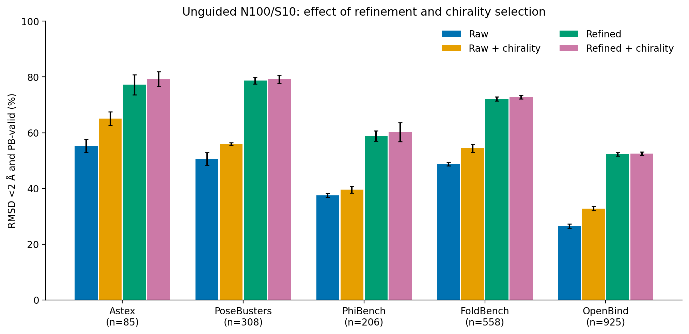
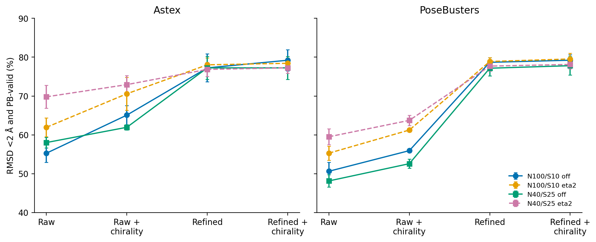
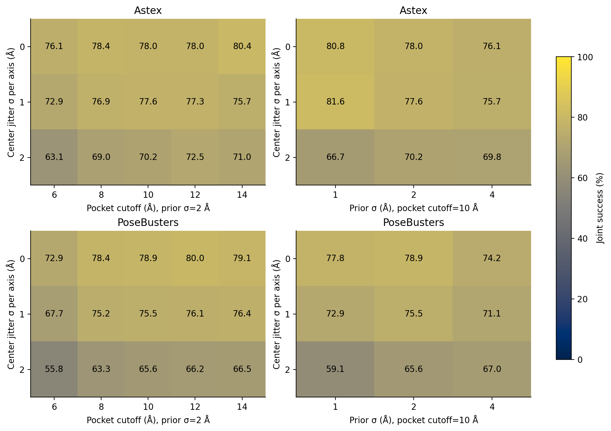

# Frozen external benchmark results

Three-repeat means ± sample SD (%). U70k confidence; early-time S50 sampler; supplied pockets.
These repeated-use external analyses do not select checkpoints or admit inference settings.

## Uniform unguided N100/S10 main table

Refinement plus input-SMILES chirality-only selection; fallback to original confidence Top-1 if all candidates fail.

| Dataset | n/seed | RMSD <2 Å | PB-valid | Joint |
|---|---:|---:|---:|---:|
| Astex | 85 | 82.35 ± 2.04 | 95.69 ± 0.68 | 79.22 ± 2.72 |
| PoseBusters | 308 | 81.60 ± 0.94 | 95.56 ± 0.50 | 79.22 ± 1.42 |
| PhiBench | 206 | 62.62 ± 3.79 | 94.01 ± 0.28 | 60.19 ± 3.36 |
| FoldBench | 558 | 74.49 ± 0.37 | 96.36 ± 0.37 | 72.82 ± 0.63 |
| OpenBind | 925 | 52.58 ± 0.61 | 99.64 ± 0.17 | 52.58 ± 0.61 |

## All generation/postprocessing conditions

| Dataset | N/S | Guidance | Stage | Selector | RMSD <2 Å | PB-valid | Joint |
|---|---|---|---|---|---:|---:|---:|
| Astex | 100/10 | off | raw | baseline | 82.75 ± 3.59 | 60.39 ± 2.45 | 55.29 ± 2.35 |
| Astex | 100/10 | off | raw | filtered | 82.75 ± 0.68 | 73.73 ± 2.96 | 65.10 ± 2.45 |
| Astex | 100/10 | off | refined | baseline | 81.96 ± 2.45 | 92.94 ± 1.18 | 77.25 ± 3.59 |
| Astex | 100/10 | off | refined | filtered | 82.35 ± 2.04 | 95.69 ± 0.68 | 79.22 ± 2.72 |
| Astex | 100/10 | eta2 | raw | baseline | 81.18 ± 2.04 | 70.59 ± 3.53 | 61.96 ± 2.45 |
| Astex | 100/10 | eta2 | raw | filtered | 82.35 ± 2.35 | 81.57 ± 5.80 | 70.59 ± 4.24 |
| Astex | 100/10 | eta2 | refined | baseline | 82.35 ± 1.18 | 93.33 ± 0.68 | 78.04 ± 1.80 |
| Astex | 100/10 | eta2 | refined | filtered | 82.35 ± 1.18 | 94.51 ± 0.68 | 78.43 ± 1.36 |
| PoseBusters | 100/10 | off | raw | baseline | 80.74 ± 0.19 | 57.58 ± 1.90 | 50.65 ± 2.27 |
| PoseBusters | 100/10 | off | raw | filtered | 79.65 ± 0.82 | 64.07 ± 0.50 | 55.95 ± 0.50 |
| PoseBusters | 100/10 | off | refined | baseline | 82.14 ± 0.65 | 93.51 ± 0.56 | 78.68 ± 1.23 |
| PoseBusters | 100/10 | off | refined | filtered | 81.60 ± 0.94 | 95.56 ± 0.50 | 79.22 ± 1.42 |
| PoseBusters | 100/10 | eta2 | raw | baseline | 80.63 ± 1.23 | 61.69 ± 1.72 | 55.30 ± 1.79 |
| PoseBusters | 100/10 | eta2 | raw | filtered | 79.87 ± 1.12 | 69.70 ± 0.19 | 61.26 ± 0.50 |
| PoseBusters | 100/10 | eta2 | refined | baseline | 82.68 ± 0.19 | 93.07 ± 1.35 | 78.90 ± 0.97 |
| PoseBusters | 100/10 | eta2 | refined | filtered | 82.47 ± 0.65 | 94.81 ± 0.86 | 79.55 ± 1.49 |
| Astex | 40/25 | off | raw | baseline | 80.00 ± 2.35 | 66.27 ± 3.59 | 58.04 ± 1.36 |
| Astex | 40/25 | off | raw | filtered | 80.00 ± 3.11 | 72.94 ± 4.24 | 61.96 ± 0.68 |
| Astex | 40/25 | off | refined | baseline | 80.39 ± 2.45 | 94.90 ± 0.68 | 77.25 ± 2.96 |
| Astex | 40/25 | off | refined | filtered | 80.39 ± 2.45 | 95.69 ± 0.68 | 77.25 ± 2.96 |
| Astex | 40/25 | eta2 | raw | baseline | 81.18 ± 2.04 | 78.82 ± 2.35 | 69.80 ± 2.96 |
| Astex | 40/25 | eta2 | raw | filtered | 80.78 ± 0.68 | 85.49 ± 2.45 | 72.94 ± 2.35 |
| Astex | 40/25 | eta2 | refined | baseline | 80.00 ± 1.18 | 94.90 ± 1.80 | 76.86 ± 1.80 |
| Astex | 40/25 | eta2 | refined | filtered | 80.00 ± 1.18 | 95.69 ± 1.36 | 77.25 ± 1.36 |
| PoseBusters | 40/25 | off | raw | baseline | 78.68 ± 0.68 | 55.52 ± 1.81 | 48.16 ± 1.60 |
| PoseBusters | 40/25 | off | raw | filtered | 76.08 ± 2.21 | 60.93 ± 1.23 | 52.60 ± 1.17 |
| PoseBusters | 40/25 | off | refined | baseline | 81.06 ± 2.35 | 93.40 ± 1.23 | 77.16 ± 1.96 |
| PoseBusters | 40/25 | off | refined | filtered | 80.30 ± 2.52 | 95.24 ± 0.68 | 77.81 ± 2.39 |
| PoseBusters | 40/25 | eta2 | raw | baseline | 80.09 ± 1.04 | 68.72 ± 2.95 | 59.52 ± 2.06 |
| PoseBusters | 40/25 | eta2 | raw | filtered | 77.49 ± 2.16 | 75.32 ± 2.60 | 63.74 ± 1.31 |
| PoseBusters | 40/25 | eta2 | refined | baseline | 80.74 ± 1.53 | 93.94 ± 0.75 | 77.71 ± 1.31 |
| PoseBusters | 40/25 | eta2 | refined | filtered | 80.09 ± 1.31 | 95.67 ± 0.37 | 78.14 ± 1.14 |
| FoldBench | 100/10 | off | raw | baseline | 72.46 ± 1.22 | 58.96 ± 0.18 | 48.75 ± 0.65 |
| FoldBench | 100/10 | off | raw | filtered | 72.04 ± 0.54 | 68.46 ± 1.29 | 54.42 ± 1.46 |
| FoldBench | 100/10 | off | refined | baseline | 74.43 ± 0.72 | 94.98 ± 0.65 | 72.16 ± 0.75 |
| FoldBench | 100/10 | off | refined | filtered | 74.49 ± 0.37 | 96.36 ± 0.37 | 72.82 ± 0.63 |
| OpenBind | 100/10 | off | raw | baseline | 49.55 ± 0.65 | 49.15 ± 0.78 | 26.56 ± 0.72 |
| OpenBind | 100/10 | off | raw | filtered | 44.90 ± 0.17 | 63.06 ± 0.25 | 32.83 ± 0.81 |
| OpenBind | 100/10 | off | refined | baseline | 52.79 ± 0.70 | 98.74 ± 0.41 | 52.29 ± 0.62 |
| OpenBind | 100/10 | off | refined | filtered | 52.58 ± 0.61 | 99.64 ± 0.17 | 52.58 ± 0.61 |
| PhiBench | 100/10 | off | raw | baseline | 60.36 ± 0.28 | 51.46 ± 1.94 | 37.54 ± 0.74 |
| PhiBench | 100/10 | off | raw | filtered | 58.41 ± 1.12 | 56.31 ± 1.68 | 39.64 ± 1.22 |
| PhiBench | 100/10 | off | refined | baseline | 63.27 ± 2.67 | 91.42 ± 0.74 | 58.90 ± 1.84 |
| PhiBench | 100/10 | off | refined | filtered | 62.62 ± 3.79 | 94.01 ± 0.28 | 60.19 ± 3.36 |

## Figure captions

**Figure 1 — Stage ablation.** Official selected-pose joint success for unguided N100/S10. Bars are three-seed means; whiskers are sample SD, not confidence intervals. All original cases remain in denominators. PhiBench includes three reconstructed cases; OpenBind is an auxiliary single-protease cohort with quality/covalent flags. Three FoldBench PB shards use the disclosed energy-reference InChI compatibility repair.



**Figure 2 — Guidance and pose/step budget.** Same-budget guided/unguided initial priors were verified by exact hash for all 2,358 new complex-repeat records. N100/S10 and N40/S25 have equal learned pose-step count, not equal runtime; priors are not asserted nested across budgets. Refinement reduces the final difference between guided and unguided conditions.



**Figure 3 — Existing pocket/prior robustness study.** Joint success means from the frozen guided-eta2 robustness campaign, refined/confidence-selected without the new chirality filter. Only the sampling crop changes; refinement/scoring retain 10 Å crops. Jitter σ is per Cartesian axis. These cells are NOT unguided results and cannot be substituted into Figure 1.



## Source identities

```json
[
  {
    "path": "outputs/benchmarks/astex_pb_unguided_r3_hostmatched_v2/factorial_report.json",
    "sha256": "4ab519ed0f739271b942adc7ccde8bd3c80c4dbc1ba12d62a687438820cb9daa"
  },
  {
    "path": "outputs/benchmarks/external_chirality_u70k_temporal_full_r3_v1/pb_inchi_compat_v1/three_seed_summary.json",
    "sha256": "9fdd8c72c8697baeb15c04afbb482fb597ab3e4a1a7d52e422334579d05293fb"
  },
  {
    "path": "outputs/benchmarks/effdock_pocket_prior_robustness_extension_runs/production-cutoff14-sigma-r3-20260906-v1/report.json",
    "sha256": "b9b6e73b206c2ec3c4df6527520695ba766d92b067b8f16fae49a12c52d34c4a"
  }
]
```
