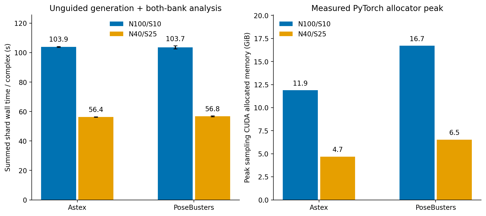

# Observed runtime and memory

| Dataset | Arm | Summed shard wall s/complex ± repeat SD | Refinement wall s/complex | Confidence wall, both banks s/complex | Sampling allocated peak GiB | Sampling reserved peak GiB |
|---|---|---:|---:|---:|---:|---:|
| astex | guided_n40_s25 | 58.81 ± 0.71 | 30.20 | 6.72 | 4.70 | 15.54 |
| posebusters | guided_n40_s25 | 58.75 ± 0.50 | 30.20 | 6.85 | 6.54 | 19.16 |
| foldbench | temporal_n100_s10 | 103.92 ± 0.35 | 70.88 | 9.72 | 17.09 | 46.69 |
| openbind | temporal_n100_s10 | 107.25 ± 1.77 | 75.01 | 9.86 | 11.80 | 46.53 |
| phibench | temporal_n100_s10 | 115.80 ± 11.61 | 74.26 | 12.47 | 17.33 | 46.70 |
| astex | unguided_n100_s10 | 103.91 ± 0.37 | 73.26 | 9.57 | 11.89 | 36.45 |
| posebusters | unguided_n100_s10 | 103.67 ± 1.02 | 72.95 | 9.86 | 16.71 | 46.66 |
| astex | unguided_n40_s25 | 56.35 ± 0.19 | 29.34 | 6.49 | 4.69 | 15.52 |
| posebusters | unguided_n40_s25 | 56.75 ± 0.34 | 29.70 | 6.73 | 6.53 | 19.13 |

## Amortized cost per generated pose / scored pose

These are batch-cost normalizations, **not measured single-pose latencies**. Pipeline and refinement divide by N generated poses; confidence divides by 2N evaluations because both raw and refined banks were scored. Raw/refined are two versions of the same N samples, not 2N independent generated samples.

| Dataset | Arm | N | Pipeline s/generated pose ± repeat SD | Refinement wall s/pose | Minimization compute s/pose | Confidence wall s/evaluated pose | Confidence forward s/evaluated pose |
|---|---|---:|---:|---:|---:|---:|---:|
| astex | guided_n40_s25 | 40 | 1.470 ± 0.018 | 0.755 | 0.721 | 0.084 | 0.036 |
| posebusters | guided_n40_s25 | 40 | 1.469 ± 0.012 | 0.755 | 0.721 | 0.086 | 0.036 |
| foldbench | temporal_n100_s10 | 100 | 1.039 ± 0.003 | 0.709 | 0.687 | 0.049 | 0.028 |
| openbind | temporal_n100_s10 | 100 | 1.072 ± 0.018 | 0.750 | 0.727 | 0.049 | 0.027 |
| phibench | temporal_n100_s10 | 100 | 1.158 ± 0.116 | 0.743 | 0.722 | 0.062 | 0.041 |
| astex | unguided_n100_s10 | 100 | 1.039 ± 0.004 | 0.733 | 0.719 | 0.048 | 0.029 |
| posebusters | unguided_n100_s10 | 100 | 1.037 ± 0.010 | 0.729 | 0.713 | 0.049 | 0.030 |
| astex | unguided_n40_s25 | 40 | 1.409 ± 0.005 | 0.733 | 0.706 | 0.081 | 0.035 |
| posebusters | unguided_n40_s25 | 40 | 1.419 ± 0.008 | 0.742 | 0.707 | 0.084 | 0.036 |

For repeat r with C complexes and shard wall durations t_j: complex cost = sum(t_j)/C; generated-pose cost = sum(t_j)/(C·N). Means and sample SD are taken across three repeat costs. Stage wall includes that stage's setup/I/O; compute-only columns use the recorded minimization/forward timers. Neither includes official PB evaluation.

GPU memory is reported only as the observed peak per sampling process/shard. It is **not divided by N or C**: model/workspace memory is shared, and per-pose memory cannot be recovered by division.

## Coverage and hardware

| Dataset | Arm | Complexes/repeat | Repeats | Generated poses across repeats | Scored raw+refined poses across repeats | Sampling devices |
|---|---|---:|---:|---:|---:|---|
| astex | guided_n40_s25 | 85 | 3 | 10,200 | 20,400 | NVIDIA RTX 6000 Ada Generation |
| posebusters | guided_n40_s25 | 308 | 3 | 36,960 | 73,920 | NVIDIA RTX 6000 Ada Generation |
| foldbench | temporal_n100_s10 | 558 | 3 | 167,400 | 334,800 | NVIDIA RTX 6000 Ada Generation |
| openbind | temporal_n100_s10 | 925 | 3 | 277,500 | 555,000 | NVIDIA H100 PCIe; NVIDIA RTX 6000 Ada Generation |
| phibench | temporal_n100_s10 | 206 | 3 | 61,800 | 123,600 | NVIDIA RTX 6000 Ada Generation |
| astex | unguided_n100_s10 | 85 | 3 | 25,500 | 51,000 | NVIDIA RTX 6000 Ada Generation |
| posebusters | unguided_n100_s10 | 308 | 3 | 92,400 | 184,800 | NVIDIA RTX 6000 Ada Generation |
| astex | unguided_n40_s25 | 85 | 3 | 10,200 | 20,400 | NVIDIA RTX 6000 Ada Generation |
| posebusters | unguided_n40_s25 | 308 | 3 | 36,960 | 73,920 | NVIDIA RTX 6000 Ada Generation |

## Interpretation and measurement boundaries

- astex: N100/S10 used 1.84× summed shard wall time per complex and 2.53× peak allocated sampling memory versus N40/S25.
- posebusters: N100/S10 used 1.83× summed shard wall time per complex and 2.56× peak allocated sampling memory versus N40/S25.

These are descriptive saved-run measurements on the recorded devices, not an isolated, randomized throughput benchmark. The compared Astex/PB runs used RTX 6000 Ada GPUs and the same frozen host-matched runtime. OpenBind includes both RTX 6000 Ada and H100 PCIe devices; its aggregate is not a hardware-controlled cross-dataset speed comparison. N100/S10 has 2.5× as many poses to refine and score; N*S equality covers only learned pose steps.

Pipeline time is sum of completed shard wall times divided by completed complexes within each repeat, then mean/sample SD across three repeats. It includes subprocess/model loading, both raw/refined confidence, I/O and driver analysis overhead, but not the separate official PB jobs. Shard elapsed times are summed across concurrently running shards; this is not user-perceived campaign wall-clock elapsed time or pure sampling latency. Sampling-only wall time was not recorded.

Stage wall means average per-complex records equally. Confidence totals score both raw and refined banks. GPU memory is the maximum of recorded sampling-process PyTorch allocator peaks over all shards and repeats, reported in GiB (2^30 bytes). Reserved memory is not allocated memory. Host requested RAM is not GPU usage; no host-RSS or refinement/scoring GPU-memory peak is claimed.

**Figure 5.** Summed unguided shard wall cost per complex (left; mean ± three-repeat sample SD) and maximum recorded sampling allocator memory (right; no SD/error bar). See measurement definitions above.

Reproduce with `scripts/collect_paper_runtime.py` then `scripts/paper_runtime_figures.py`. Detailed measured stage fields and source manifest digest are in `runtime_metrics.json`.
The unit-explicit aggregate is available as [JSON](runtime_comparison.json) and [CSV](runtime_comparison.csv).
