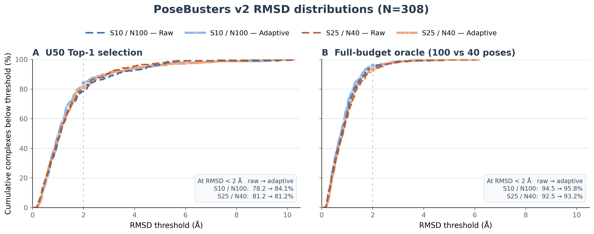
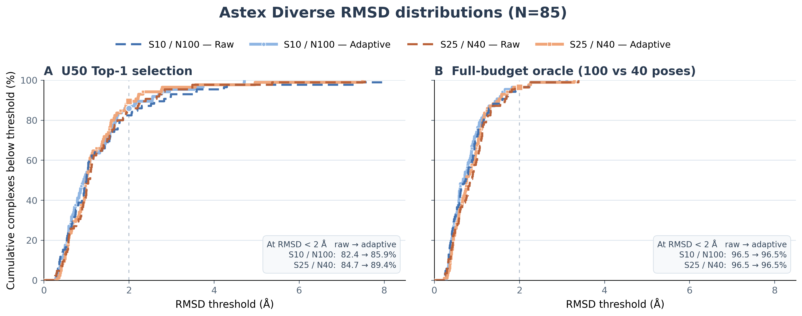
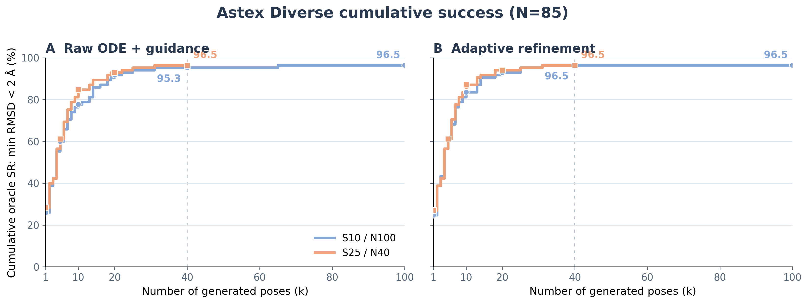

# Fixed-NFE step/pose allocation

These are the publication-ready figures and public figure-source tables for
protocol `EFFDOCK-FIXED-NFE-STEP-POSE-V1`. The comparison uses one frozen seed
and a matched budget of 1,000 learned-model pose steps per complex:

- `S10 / N100`: 10 ODE steps × 100 poses;
- `S25 / N40`: 25 ODE steps × 40 poses;
- sigma 2.0, normalized unified guidance at eta 2.0;
- raw ODE endpoint and the frozen adaptive 100-step post-refinement endpoint;
- U50k symmetry-confidence selection, independently applied at each endpoint.

Astex Diverse and PoseBusters v2 had already been opened before this
comparison. The results are therefore paired descriptive characterizations,
not independent external validation or a hyperparameter-selection result.

## RMSD distributions

The left panel is U50k-confidence Top-1 selection. The right panel is the
within-arm full-budget oracle: Oracle@100 for `S10 / N100` and Oracle@40 for
`S25 / N40`. Consequently, the oracle panel is a ceiling for each fixed-NFE
arm, not a pose-count-matched comparison.



[Vector PDF](figures/posebusters_top1_oracle_rmsd_cdf.pdf)



[Vector PDF](figures/astex_top1_oracle_rmsd_cdf.pdf)

## Cumulative oracle success

These curves use original sampling order. At the common `k=40` support they
show pose-count-matched Oracle@40; the two fixed-NFE endpoints are `k=100` for
`S10 / N100` and `k=40` for `S25 / N40`.


[Vector PDF](figures/posebusters_cumulative_oracle_sr.pdf)



[Vector PDF](figures/astex_cumulative_oracle_sr.pdf)

## Frozen values

All success rates use symmetry-aware no-alignment heavy-atom RMSD strictly
below 2 Å. `Final oracle` means Oracle@100 for `S10 / N100` and Oracle@40 for
`S25 / N40`.

| Dataset | Arm | Top-1 raw → adaptive | Oracle@40 raw → adaptive | Final oracle raw → adaptive |
|---|---|---:|---:|---:|
| Astex Diverse (85) | S10 / N100 | 82.35% → 85.88% | 95.29% → 96.47% | 96.47% → 96.47% |
| Astex Diverse (85) | S25 / N40 | 84.71% → 89.41% | 96.47% → 96.47% | 96.47% → 96.47% |
| PoseBusters v2 (308) | S10 / N100 | 78.25% → 84.09% | 91.23% → 92.21% | 94.48% → 95.78% |
| PoseBusters v2 (308) | S25 / N40 | 81.17% → 81.17% | 92.53% → 93.18% | 92.53% → 93.18% |

Astex has only 85 complexes, so one complex changes a reported rate by 1.18
percentage points. These figures report RMSD only; they do not include
PoseBusters PL-validity or official PB-validity.

## Provenance and reproduction

- [Protocol](../../FIXED_NFE_STEP_POSE_PROTOCOL.md)
- [Selected-pose PoseBusters protocol](../../FIXED_NFE_STEP_POSE_PB_PROTOCOL.md)
- [`complex_metrics.csv`](complex_metrics.csv), public LF-normalized SHA-256
  `b4f0efd67458652f039a689754cf1b37ed333089c11eaa76d41647149a76ed8e`
- [`cumulative_oracle_sr.csv`](cumulative_oracle_sr.csv), public LF-normalized
  SHA-256
  `d482832ad53a869b8187f714e29e73c39e3c170838217cb1023c14de9efca160`
- [`SHA256SUMS`](SHA256SUMS) for every published table and figure.

The frozen source-run hashes before line-ending normalization are
`86ddf0da1f179d2afd702dbabdbb0de18d8ec68b76ea74a0f284c53aac508aaa`
and `1dba36b65339f6a1897b572ef13d82aa2e867894564eac8e9d685150ca4253b4`,
respectively. Only CRLF-to-LF normalization changed; parsed rows and values are
identical.

The figures were rendered with Matplotlib 3.10.8:

```bash
uv run --with matplotlib==3.10.8 python \
  scripts/figures/plot_fixed_nfe_top1_oracle_cdf.py \
  --input docs/results/fixed_nfe_u50/complex_metrics.csv \
  --dataset posebusters \
  --output docs/results/fixed_nfe_u50/figures/posebusters_top1_oracle_rmsd_cdf.png

uv run --with matplotlib==3.10.8 python \
  scripts/figures/plot_fixed_nfe_cumulative_oracle.py \
  --input docs/results/fixed_nfe_u50/cumulative_oracle_sr.csv \
  --dataset posebusters \
  --output docs/results/fixed_nfe_u50/figures/posebusters_cumulative_oracle_sr.png
```

Use `--dataset astex` and the corresponding Astex output name to regenerate
the Astex figures. Each command writes both PNG and PDF versions.
